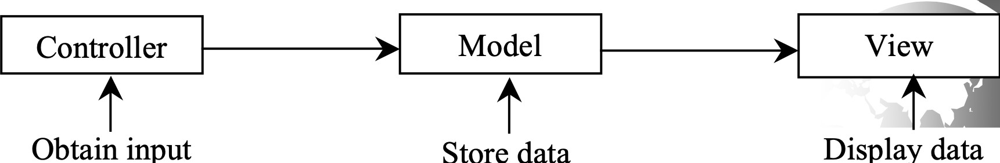

## Java应用技术4：高阶应用

#### 1.Swing GUI和MVC设计模式

- 我觉得具体的Swing组件没有必要去记

- MVC设计模式

  - MVC是Model-View-Controller的简称，即
    - C负责获取输入
    - M负责存储数据
    - V负责展示数据

  
  - 要注意模型和视图层之间的数据同步

- Swing GUI就是根据MVC模式设计的

#### 2.Socket网络编程

#### 3.数据库JDBC编程

#### 4.流计算和lambda表达式